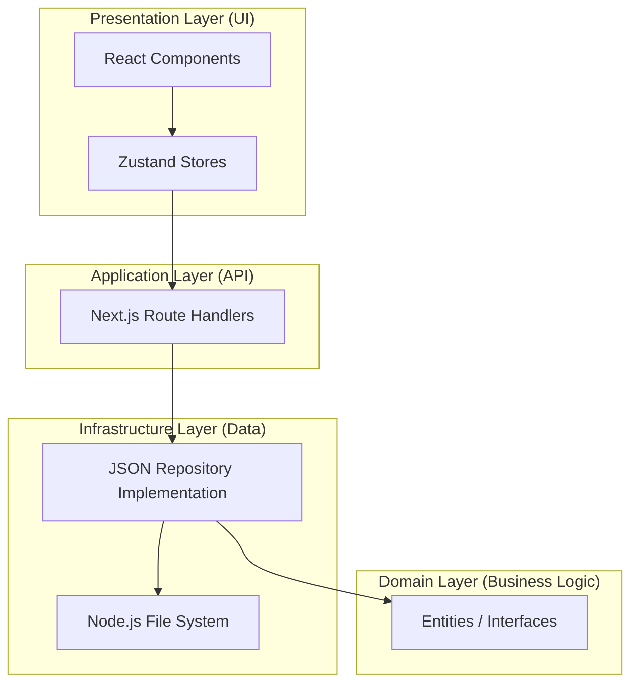

# Project Architecture Documentation

Welcome to the **PWA Projects & Tasks** architecture guide. This document is designed to help you understand how the application is built, why certain decisions were made, and how you can contribute to the project.

---

## 1. High-Level Architecture

The project follows a **Clean Architecture** pattern. This means we separate the "Business Logic" (what the app does) from the "Infrastructure" (how it stores data, how the UI looks).

### Architecture Diagram

---

## 2. Layers Explained

### 📂 Domain Layer (`src/domain`)
This is the "heart" of the application. It contains only interfaces and types. It doesn't know about databases or APIs.
- **[entities.ts](file:///Users/filio/Work/DEVELOPMENT/NEXT/PWA/src/domain/entities.ts)**: Defines what a `Project` and a `Task` look like.
- **[repositories.ts](file:///Users/filio/Work/DEVELOPMENT/NEXT/PWA/src/domain/repositories.ts)**: Defines the *contracts* for how we fetch/save data.

### 📂 Infrastructure Layer (`src/infrastructure`)
This is where the actual work of saving data happens.
- **[persistence.ts](file:///Users/filio/Work/DEVELOPMENT/NEXT/PWA/src/infrastructure/persistence.ts)**: Implements the repositories using the local File System (`fs`) and JSON files.
- **Why JSON?** For a junior-friendly project, this removes the need for a complex database setup (PostgreSQL/MongoDB) while still teaching how data persistence works.

### 📂 Application Layer (`src/app/api`)
These are our **Next.js Route Handlers** (API Endpoints).
- They receive HTTP requests (GET, POST, etc.).
- They validate the data using **Zod**.
- They call the Infrastructure layer to save or fetch data.

### 📂 Presentation Layer (`src/features` & `src/components`)
- **[features/](file:///Users/filio/Work/DEVELOPMENT/NEXT/PWA/src/features)**: Contains complex logic tied to a specific feature (e.g., `ProjectCard`, `TaskList`).
- **[components/ui/](file:///Users/filio/Work/DEVELOPMENT/NEXT/PWA/src/components/ui)**: Low-level, reusable UI atoms (Buttons, Inputs) from **shadcn/ui**.
- **[stores/](file:///Users/filio/Work/DEVELOPMENT/NEXT/PWA/src/stores)**: Uses **Zustand** to manage global state and handle API calls from the UI.

---

## 3. Data Flow: How a Task is Created

When a user clicks "Add Task", the following happens:

1.  **UI Component**: `TaskList.tsx` calls `addTask()` in the `useProjectStore`.
2.  **Zustand Store**: `useProjectStore` sends a `POST` request to `/api/projects/[id]/tasks`.
3.  **API Route**: The Route Handler validates the input with **Zod** and calls `taskRepository.create()`.
4.  **Infrastructure**: `JsonTaskRepository` reads `tasks.json`, adds the new task, and writes it back to the disk.
5.  **UI Update**: The store receives the new task from the API and updates its local state, causing the React component to re-render.

---

## 4. Progressive Web App (PWA)

This app is a PWA, meaning it can be "installed" on your phone or computer and work offline.

- **[Serwist](https://serwist.pages.dev/)**: We use this library to manage our **Service Worker**.
- **Service Worker ([sw.ts](file:///Users/filio/Work/DEVELOPMENT/NEXT/PWA/src/sw.ts))**: A script that runs in the background. it intercepts network requests to cache files, allowing the app to load without internet.
- **Manifest ([manifest.webmanifest](file:///Users/filio/Work/DEVELOPMENT/NEXT/PWA/public/manifest.webmanifest))**: A JSON file that tells the browser how the app should look when installed (icons, colors, name).

---

## 5. Styling with Tailwind CSS v4

We use the latest **Tailwind CSS v4**. Unlike older versions, v4 is "CSS-first".
- **Theme Variables**: Instead of a long `tailwind.config.js`, we define our colors and fonts directly in [globals.css](file:///Users/filio/Work/DEVELOPMENT/NEXT/PWA/src/app/globals.css) using the `@theme` block.
- **Performance**: This integrates deeply with **Next.js Turbopack** for lightning-fast builds.

---

## 6. Development "How-To" Guide

### How to add a new UI component?
1.  Check if it exists in [shadcn/ui](https://ui.shadcn.com/).
2.  Add the component file to `src/components/ui`.
3.  Export it for use in features.

### How to add a new API endpoint?
1.  Create a folder in `src/app/api/your-feature`.
2.  Create a `route.ts` file.
3.  Define your `GET/POST/PATCH/DELETE` functions.
4.  Always use **Zod** to validate the `request.json()`.

### How to run tests?
- Run `pnpm test` to run all unit tests.
- Tests are located next to the files they test (e.g., `persistence.test.ts`).

---

## 7. Tech Stack Summary for Juniors

| Tool | Purpose | Why? |
| :--- | :--- | :--- |
| **Next.js 16** | Framework | Handles both Frontend and Backend (API). |
| **TypeScript** | Language | Prevents bugs by making sure data has the right "shape". |
| **Zustand** | State | Simple and fast way to share data between components. |
| **Biome** | Linter | Fast tool to keep code clean and formatted. |
| **Vitest** | Testing | Modern and fast alternative to Jest. |
| **Serwist** | PWA | Best-in-class tool for offline support in Next.js. |
